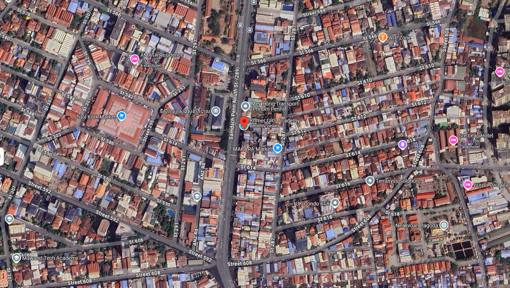

# __About Us__

Khmer GRS Academy (KGA) គឺជាស្ថាប័នអប់រំមួយ ដែលមានទីតាំងស្ថិតនៅភ្នំពេញ ប្រទេសកម្ពុជា។ បង្កើតឡើងក្នុងឆ្នាំ 2020 KGA មានឯកទេសក្នុងការបណ្តុះបណ្តាល និងផ្តល់សេវាកម្ម លើប្រព័ន្ធព័ត៌មានភូមិសាស្រ្ត (GIS)។ បេសកកម្មរបស់យើងគឺផ្តល់នូវការហ្វឹកហ្វឺនចំណេះជំនាញ ដល់អ្នកសិក្សា ទាំងបុគ្គលនិងអង្គភាពផ្សេងៗ ឲ្យមានជំនាញ និងដំណោះស្រាយថ្មីៗទាក់ទងនឹង GIS ច្បាស់លាស់ ដើម្បីបម្រើដល់ការអភិវឌ្ឍសង្គមកម្ពុជា។

## __អ្វីដែលយើងផ្តល់ឲ្យ__

### __វគ្គសិក្សា__
នៅ Khmer GRS Academy យើងមានផ្តល់នូវវគ្គសិក្សាជំនាញ GIS ដោយប្រើប្រាស់កម្មវិធី GIS ល្បីផ្សេងៗរួមមាន៖

- __ArcMap__: នៅក្នុងវគ្គសិក្សានេះ អ្នកនឹងរៀនពីរបៀបបង្កើតផែនទី វិភាគទិន្នន័យ និងស្វ័យប្រវត្តិកម្មលំហូរការងារដោយប្រើកម្មវិធី ArcMap។ មិនថាអ្នកជាសិស្សថ្មី ឬធ្លាប់មានបទពិសោធន៍ខ្លះៗ វគ្គសិក្សានេះផ្តល់ឱ្យអ្នកនូវជំនាញដែលអ្នកត្រូវការដើម្បីទទួលបានជោគជ័យក្នុងវិស័យភូមិសាស្រ្តមួយនេះ។
- __ArcGIS Pro__: គឺជាកម្មវិធី GIS ឥតគិតថ្លៃ និងបើកចំហទៅកាន់អ្នកប្រើប្រាស់។ នៅក្នុងវគ្គសិក្សានេះ អ្នកនឹងរៀនពីរបៀបប្រើប្រាស់ QGIS ដើម្បីបង្កើតផែនទី វិភាគទិន្នន័យ និងធ្វើការវិភាគលើលំហ។ វគ្គសិក្សានេះអាចរៀនបានទាំងអ្នកមិនចេះសោះ និងអ្នកដែលមានបទពិសោធន៍ខ្លះៗរួចហើយ។
- __QGIS__: ArcGIS Pro គឺជាកម្មវិធី GIS ចុងក្រោយ និងទំនើបបំផុតរបស់ Esri។ នៅក្នុងវគ្គសិក្សានេះ អ្នកនឹងរៀនពីរបៀបប្រើប្រាស់ ArcGIS Pro ដើម្បីបង្កើត និងវិភាគផែនទី 2D និង 3D ធ្វើការវិភាគលើលំហ និងចែករំលែកការងាររបស់អ្នកជាមួយអ្នកដទៃ។

យើងផ្តោតលើគុណភាពមេរៀននីមួយៗ ដោយធ្វើកំណែទម្រង់លើមាតិកា និងតែងតែធ្វើបច្ចុប្បន្នភាពមេរៀន ដើម្បីឲ្យគុណភាពអប់រំកាន់តែមានស្តង់ដារ។ ការបង្កើតធនធានមនុស្សជាមួយនឹងជំនាញដ៏ពិតប្រាកដមួយ ជាគោលដៅរបស់ស្ថាប័នក៏ដូចជាក្រុមរបស់យើងខ្ញុំ។ ភាពត្រេកអររបស់អ្នក ជាក្តីអំណររបស់ក្រុមយើងខ្ញុំ។

### __សេវាកម្មរបស់យើង__
ក្រៅពីវគ្គសិក្សា និងសេវាបង្រៀន, KGA ក៏ផ្តល់នូវសេវាកម្មដែលទាក់ទៅហ្នឹង GIS ផងដែរ។ សេវាកម្មនោះរួមមាន:

- __ការប្រមូលទិន្នន័យ__ (Data collection)
- __ការរៀបចំ និងសម្អាតទិន្នន័យ__ (Data organization and cleaning)
- __ការវិភាគទិន្នន័យ__ (Spatial analysis) ជាដើម។

សេវាកម្មទាំងនេះនឹងជួយសម្រួលដល់អាជីវកម្ម អ្នកស្រាវជ្រាវ និងស្ថាប័ន ធ្វើការលើទិន្នន័យភូមិសាស្ត្របានយ៉ាងមានប្រសិទ្ធភាព។

### __ឱកាសអាហារូបករណ៍__
ដើម្បីជំរុញការអប់រំ និងការប្រើប្រាស់ GIS​ កាន់តែទូលំទូលាយ, KGA បានផ្តល់អាហារូបករណ៍ដល់សិស្សនិស្សិតដែលបង្ហាញពីចំណាប់អារម្មណ៍ខ្លាំងលើផែនទី និងបច្ចេកវិទ្យាភូមិសាស្រ្ត។ រយៈពេលនៃការដំណើរការនេះមានគោលបំណងបណ្តុះអ្នកជំនាញ GIS ជំនាន់ក្រោយនៅកម្ពុជា។

## __បណ្តាញសង្គមរបស់យើង__
Khmer GRS Academy ប្រើប្រាស់បណ្តាញសង្គមមួយចំនួនដើម្បីចែករំលែកចំណេះដឹង GIS រួមមាន

- [Facebook Page: Khmer GRS Academy]{:target="_blank"}
- [YouTube Channel: Khmer GIS Academy]{:target="_blank"}
- [TikTok]{:target="_blank"}
- [Telegram Channel]{:target="_blank"}

តាមដានយើង ដើម្បីទទួលបានព័ត៌មានបន្ថែមអំពីវគ្គសិក្សា និងចំណេះដឹងផ្សេងៗ

[Facebook Page: Khmer GRS Academy]:https://www.facebook.com/khmergisacademy/
[YouTube Channel: Khmer GIS Academy]:https://www.youtube.com/c/KhmerGISAcademy/videos
[TikTok]:https://www.tiktok.com/@khmergrsacademy
[Telegram Channel]:https://t.me/s/khmergrsacademychannel

## __ទំនាក់ទំនងព័ត៌មានបន្ថែម__

- **Phone**: +855 81 373 833
- **Email**: academy@khmergrs.com
- **Address**: Building No. 48, Street 289, Boeung Kak II, Toul Kork District, Phnom Penh, Cambodia

[ចុចមើលទីតាំងលើ Google Map]{:target="_blank"}

[ចុចមើលទីតាំងលើ Google Map]:https://maps.app.goo.gl/sPpWC6pLUS5HiBNCA

ចូលទៅកាន់គេហទំព័ររបស់យើង: [khmergrs.com]{:target="_blank"}

[khmergrs.com]: https://www.khmergrs.com/
