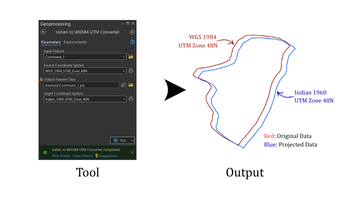

## __Indian To WGS 1984 UTM Converter__

## Goal
Project Dataset from `Indian Datum` to `WGS 1984 UTM Zone 48N` and vise versa.

## Summary
Projects spatial datasets between `Indian datums` (Indian 1954, 1960, and 1975) and `WGS 1984 coordinate systems`, supporting both `geographic (GCS)` and `projected (UTM Zone 48N)` transformations. This tool enabled seamless integration of spatial datasets stored in legacy Indian datums with modern WGS84 datasets (and vice versa). 

### Illustration

### Usage Notes

- Choose the `Input Feature`.
- The `Source Coordinate System` is auto detected from the dataset (tool won’t run if the coordinate reference system of input feature is __Unknown__)
- Specify the Target Coordinate System:

     - WGS84 (GCS_WGS_1984 or WGS84 / UTM Zone 48N)
     - Indian CRS (GCS_Indian_1954 / GCS_Indian_1960 / GCS_Indian_1975 or Indian54/60/75/ UTM Zone 48N)

- The tool automatically applies the appropriate geographic transformation based on the selected source–target pair. If the source GCS was different from target GCS, the transform was chosen. 

- The transform methods were included as below:

     - `Indian 1954 to WGS 1984: Indian_1954_To_WGS_1984`
     - `Indian 1960 to WGS 1984: Indian_1960_To_WGS_1984_2`
     - `Indian 1975 to WGS 1984: Indian_1975_To_WGS_1984_4`

- Output dataset with the projected CRS.

### Parameters
This tool comes with four importance parameters.

| Parameter | Explanation | Data Type |
|:---------|:------------|:----------|
| Input_Feature | Dataset to be projected | GPFeatureLayer |
| Input_Coordinate_System (Optional) | <strong>Auto-filled from Input Feature.</strong> The tool will not run if the coordinate reference system is unknown. | GPCoordinateSystem |
| Output_Feature_Class | Location and name of the transformed dataset | DEFeatureClass |
| Choose_Target_PCS | <strong>Target CRS.</strong> Supports both WGS84 (GCS or UTM) and Indian (GCS or UTM). | GPCoordinateSystem |

### Tool Demo

Learn how to use the tool

<iframe
  width="100%"
  height="600"
  src="https://www.youtube.com/embed/IgYOWnzz2lA"
  title="Land Parcel Data | Attribute Field Format Checking | KGA TOOLBOX"
  frameborder="0"
  allow="accelerometer; autoplay; clipboard-write; encrypted-media; gyroscope; picture-in-picture; web-share"
  allowfullscreen>
</iframe>

### Purchase Toolbox

See toolbox [license package](pricing.md).

[Contact Sale :fontawesome-solid-paper-plane:](https://t.me/khmergrsacademy){ .md-button target="_blank" rel="noopener"}