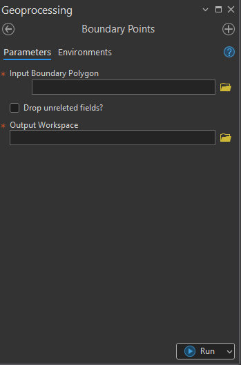
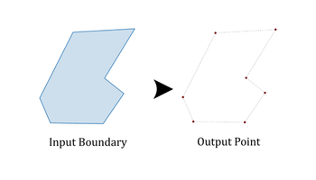

## Goal
Create ```boundary point``` from an input ```polygon boundary```.

## Summary
__Boundary Point Tool__ converts polygon boundaries into point features representing each vertex along the polygon’s perimeter. It is designed to support land parcel management, topology validation, and boundary-based analyses by generating accurate, georeferenced point features from polygon geometries. 



The tool can optionally remove non-essential attribute fields in the output to streamline subsequent workflows.

## Illustration



## Usage Notes

* Each output point corresponds to a vertex along the polygon’s exterior boundary.
* The tool preserves all fields from the input unless the Drop unrelated fields? option is enabled.
* The output feature class is automatically named based on the input layer name.
* This tool supports both workspaces including file geodatabases, and folder.

## Parameters

This tool has three importances parameters as show in the table below.

| Parameter | Explanation | Data Type |
|----------|-------------|-----------|
| Input_Boundary_Polygon | The polygon feature class from which boundary vertices will be extracted.<br> | GPMultiValue |
| Drop_unrelated_fields? (Optional) | Option to drop all fields inherited from the input layer in the output point dataset.<br><br>**Check:** Only essential system and geometry-related fields will be retained in the output feature class. All additional user-defined attribute fields from the input polygon will be removed.<br><br>**Uncheck:** Keep all fields.<br> | GPBoolean |
| Output_Workspace | The workspace to store the output point feature class.<br> | GPComposite |

## Limitations

* Input must be polygon feature; points or line are not supported.
* Extremely large polygon datasets may result in high vertex counts and increased processing time.
* Z and M Value are preserved only if they exist in the input feature.

## Demo

Learn how to use the tool

<iframe
  width="100%"
  height="600"
  src="https://www.youtube.com/embed/IgYOWnzz2lA"
  title="Land Parcel Data | Attribute Field Format Checking | KGA TOOLBOX"
  frameborder="0"
  allow="accelerometer; autoplay; clipboard-write; encrypted-media; gyroscope; picture-in-picture; web-share"
  allowfullscreen>
</iframe>

## Purchase Toolbox

See toolbox [license package](pricing.md).

[Contact Sale :fontawesome-solid-paper-plane:](https://t.me/khmergrsacademy){ .md-button target="_blank" rel="noopener"}