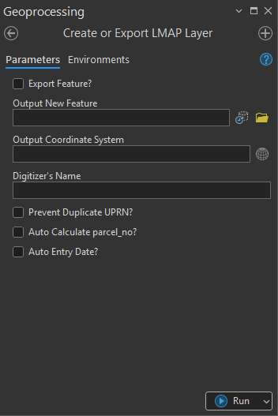
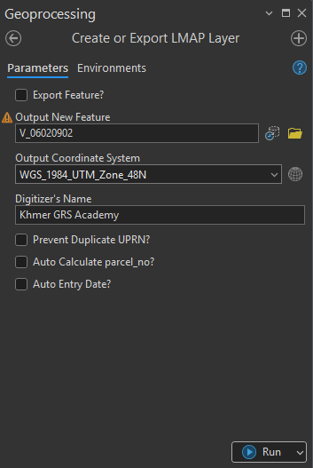

## Goal
Create a ```LMAP polygon layer``` with standard fields required by [MLMUPC](https://mlmupc.gov.kh/){:target="_blank"}

## Summary

The __Create or Export LMAP Layer__ generates a new LMAP-compliant feature class or exports an existing LMAP layer to a new file geodatabase. This tool is designed to standardize parcel capture workflows, enforce data quality rules, and streamline digitization activities within land management and mapping environments. 

This tool incorporates optional automation functions for unique identifiers, parcel numbering, and timestamp population. 



Optional quality control logic helps maintain data integrity, including detecting duplicate UPRNs, automatically calculating parcel numbers, and inserting data entry timestamps.

## Illustration

Tool with parameters input



Result after the creation (image below). Attribue Fields and theirs have been priorly set and data is ready to digitze. Data digitization and record value entry could be improved effectively with the the last three parameters. 


## Usage Note

* If Export Feature? option is not checked, the tool creates an empty LMAP feature class with predefined schema and user-specified coordinate system.
* If Export Feature? is checked, the tool copies the selected LMAP layer to a new file geodatabase.
* The output feature class can be written in a file geodatabase (shapefile not recommended due to field name restrictions).
* The tool is typically used at the start of a digitization session or during controlled parcel update workflows.

## Parameters

This tool has some importances parameters as show in the table below.

| Parameter | Explanation | Data Type |
|:---------|:------------|:----------|
| Export_Feature? (Optional) | Determines whether to export existing LMAP feature classes to a new file geodatabase.<br>• **Unchecked:** The tool creates a new empty LMAP feature class.<br>• **Checked:** The tool exports the selected feature(s), ensuring schema consistency and applying optional automation rules.<br> | GPBoolean |
| Output_New_Feature (Optional) | The path and name of the new LMAP feature class to be created. Output as shapefile is not recommended.<br><br>The output feature class name is restricted to follow the naming rule of LMAP – e.g. **V_01010101**, where the 8-digits number is the village code.<br> | DEFeatureClass |
| Output_Coordinate_System (Optional) | Specifies the coordinate system for the output feature class. PCS is recommended.<br> | GPCoordinateSystem |
| Digitizer's_Name (Optional) | Name of digitizer.<br> | GPString |
| Prevent_Duplicate_UPRN? (Optional) | Option to prevent duplicate UPRNs number.<br>• **Check:** Apply duplicate prevention to UPRN field.<br>• **Uncheck:** UPRN field can accept duplicate values.<br> | GPBoolean |
| Auto_Calculate_parcel_no (Optional) | Option to calculate **parcel_no** value automatically.<br>• **Check:** Automatically calculate parcel_no value during digitization session.<br>• **Uncheck:** parcel_no value will not be calculated automatically during digitization session.<br> | GPBoolean |
| Auto_Entry_Date (Optional) | Option to automatically enter the current date value to **entry_dt** field.<br><br>• **Check:** entry_dt value will be updated automatically.<br>• **Uncheck:** entry_dt value will not be populated.<br> | GPBoolean |
| Input_Features_to_Export (Optional) | Input LMAP feature to export.<br> | GPMultiValue |
| Output_Workspace (Optional) | Specify workspace location.<br> | GPComposite |


## Limitation

* [Shapefile](https://en.wikipedia.org/wiki/Shapefile){:target="blank"} is not recommended.
* Output Feature class name is restricted to follow the ```naming rule of LMAP``` - eg: __V_01010101__, where the 8digits number is the __village code__.

## Demo

Learn how to use the tool

<iframe
  width="100%"
  height="600"
  src="https://www.youtube.com/embed/IgYOWnzz2lA"
  title="Land Parcel Data | Attribute Field Format Checking | KGA TOOLBOX"
  frameborder="0"
  allow="accelerometer; autoplay; clipboard-write; encrypted-media; gyroscope; picture-in-picture; web-share"
  allowfullscreen>
</iframe>

## Purchase Toolbox

See toolbox [license package](../pricing.md).

[Contact Sale :fontawesome-solid-paper-plane:](https://t.me/khmergrsacademy){ .md-button target="_blank" rel="noopener"}