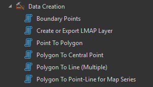

The __Data Creation toolset__, showcased here from the larger ArcGIS Pro toolbox, is a specialized collection of tools dedicated to generating new spatial data and transforming existing feature geometries. It includes functions like Boundary Points to delineate feature edges and geometric conversion tools such as Point To Polygon, Polygon To Central Point, and Polygon To Line (Multiple), which are essential for restructuring data for different analytical or visualization needs. 

The presence of tools like Create or Export LMAP Layer and Polygon To Point-Line for Map Series suggests this toolset is tailored to support specific, standardized internal mapping or land management workflows, ensuring the efficient and accurate production of derivatives required for cartography and spatial analysis projects.

__Data Creation Toolset__ consists of 6 tools including:

- [Boundary Point](boundary_point.md)
- [Create and Export LMAP Layer](create_lmap.md)
- [Point to Polygon](point_to_polygon.md)
- [Polygon to Central Point](polygon_to_central_point.md)
- [Polygon to Line (Multiple)](polygon_to_line_mult.md)
- [Polgon to Point-Line for Map Series](polygon_pointline_mapseries.md)

__Purchase Toolbox__

See toolbox [license package](../pricing.md).

[Contact Sale :fontawesome-solid-paper-plane:](https://t.me/khmergrsacademy){ .md-button target="_blank" rel="noopener"}

