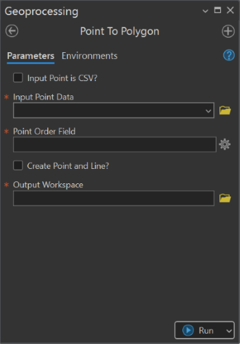
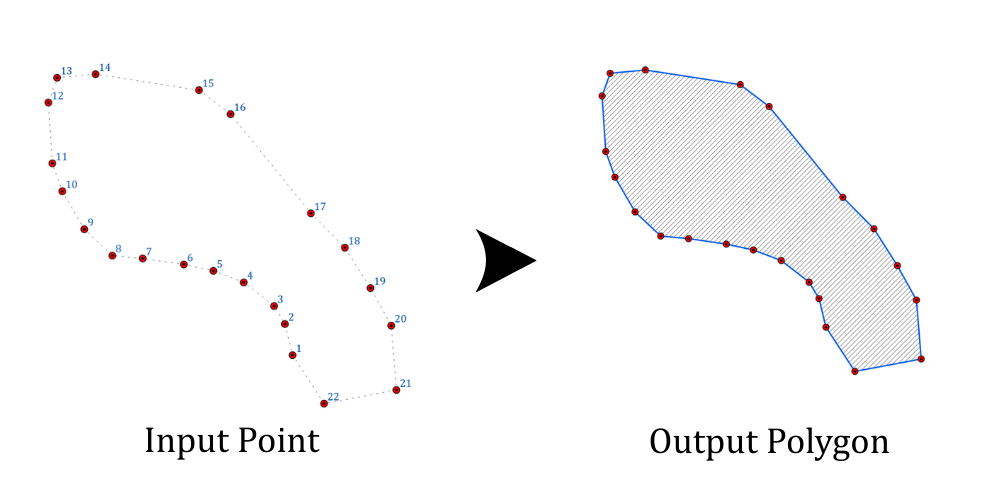

## Summary
This tool converts a set of ordered point features into a polygon and/or line feature. The order is controlled by a numeric field within the input data. 

The input points can be an existing feature class or a CSV file. If the input is a __CSV file__, defining ```X``` and ```Y fields``` is a must to create a point feature first before constructing polygon and line feature class.


## Illustration



## Usage Note

* The Point Order Field must contain values that determine the sequence in which points will be connected.
* When using a CSV file, X/Y fields and (optionally) an input coordinate system must be specified.
* If the Create Point and Line? option is selected, the tool outputs the original point features and a line connecting them in addition to the polygon.
* Points should define a closed shape; the tool automatically closes the polygon by connecting the last point to the first.

## Parameters

This tool has some importances parameters as show in the table below.

| Parameter | Explanation | Data Type |
|:---------|:------------|:----------|
| Input_Point_is_CSV? (Optional) | Specifies whether the input point data is a CSV file instead of a feature class.<br><br>• **Unchecked (default):** Input is a point feature class.<br>• **Checked:** CSV options (X Field, Y Field, Coordinate System) become available. | GPBoolean |
| Input_Point_Data | The point dataset or CSV file to process. | GPComposite |
| X_Field (Optional) | Specifies the attribute column containing X-coordinate values. | Field |
| Y_Field (Optional) | Specifies the attribute column containing Y-coordinate values. | Field |
| Point_Order_Field | Choose the order field in which points are connected to form the polygon. | Field |
| Input_Coordinate_System (Optional) | Defines the spatial reference of the CSV’s coordinate values. | GPCoordinateSystem |
| Keep_Point_and_or_Line? (Optional) | Option to create point (if the input is CSV) and line from the input point data.<br><br>• **Check:** The tool creates cleaned point and line features connecting the points in order.<br>• **Uncheck:** Only the polygon is constructed. | GPBoolean |
| Output_Workspace | Folder or geodatabase where the polygon (and optional point/line layers) will be saved. | DEWorkspace |

## Limitation

* Point feature inputs are required to be preconfigured with a valid Order ID attribute prior to execution.
* This tool supports only one polygon output per operation and does not allow batch or multi-polygon generation.

## Tool Demo

Learn how to use the tool

<iframe
  width="100%"
  height="600"
  src="https://www.youtube.com/embed/IgYOWnzz2lA"
  title="Land Parcel Data | Attribute Field Format Checking | KGA TOOLBOX"
  frameborder="0"
  allow="accelerometer; autoplay; clipboard-write; encrypted-media; gyroscope; picture-in-picture; web-share"
  allowfullscreen>
</iframe>

## Purchase Toolbox

See toolbox [license package](../pricing.md).

[Contact Sale :fontawesome-solid-paper-plane:](https://t.me/khmergrsacademy){ .md-button target="_blank" rel="noopener"}
