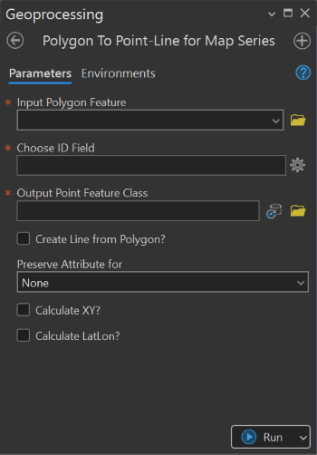
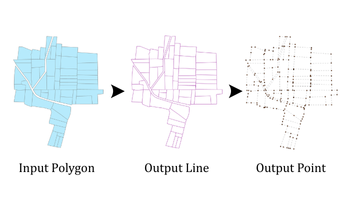

## Goal

Create ```Point Feature Class``` and ```Line Feature Class``` feature class from ```input polygon``` specifically for __Map Series__.

## Summary

This tool generates ```unique point identifiers``` and ```line feature class``` for a given ```polygon feature class```. The tool is useful for creating point and line-based map series, indexing parcels, and spatially identifying features.


## Illustration



## Usage Note

* The tool works best with ```polygon feature classes``` representing parcels.
* The generated Point ID follows a sequential or custom logic defined in the script.
* If the __Reserve Attribute?__ option is enabled, attributes from the input feature class will be copied to the output point feature class.

## Parameters

This tool has some importances parameters as show in the table below.

| Parameter | Explanation | Data Type |
|:---------|:------------|:----------|
| Input_Parcel_Data | The input parcel feature class from which point features will be generated. | GPFeatureLayer |
| Choose_ID_Field | Select the field from the input parcel feature that contains ID information (integer data type). | Field |
| Output_Point_Feature_Class | Specify the location and name of the output point feature class. | DEFeatureClass |
| Create_Line_from_Polygon? (Optional) | Specifies whether to create line features from the input polygon.<br><br>• **Check:** Line features will be generated.<br>• **Uncheck:** Line features will not be created. | GPBoolean |
| Output_Line_Feature_Class (Optional) | Specify the location and name of the output line feature class. | DEFeatureClass |
| Reserve_Attribute? (Optional) | Option to retain selected attributes from the input parcel feature class in the output.<br><br>• **Output Point and Line:** Attribute information is preserved for both output point and line feature classes.<br>• **Output Point:** Attribute information is preserved only for the output point feature class.<br>• **Output Line:** Attribute information is preserved only for the output line feature class.<br>• **None (Default):** Attribute information is not included in the output. | GPString |
| Calculate_XY? (Optional) | Specifies whether to calculate XY coordinates for the output point feature class.<br><br>• **Check:** XY coordinates are calculated using the coordinate system inherited from the input polygon. Output fields will be **Northing** and **Easting**.<br>• **Uncheck:** XY coordinates are not calculated. | GPBoolean |
| Calculate_LatLon? (Optional) | Specifies whether to calculate geographic coordinates for the output point feature class.<br><br>• **Check:** Latitude and Longitude values are calculated using the coordinate system inherited from the input polygon.<br>• **Uncheck:** Latitude and Longitude values are not calculated. | GPBoolean |


## Tool Demo

Learn how to use the tool

<iframe
  width="100%"
  height="600"
  src="https://www.youtube.com/embed/IgYOWnzz2lA"
  title="Land Parcel Data | Attribute Field Format Checking | KGA TOOLBOX"
  frameborder="0"
  allow="accelerometer; autoplay; clipboard-write; encrypted-media; gyroscope; picture-in-picture; web-share"
  allowfullscreen>
</iframe>

## Purchase Toolbox

See toolbox [license package](../pricing.md).

[Contact Sale :fontawesome-solid-paper-plane:](https://t.me/khmergrsacademy){ .md-button target="_blank" rel="noopener"}