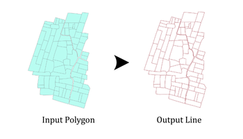

## Summary
This tool processes ```multiple polygon feature classes``` in a batch-like workflow. For each input __polygon dataset__, the tool extracts the ```polygon boundaries``` and converts them to __line feature classes__. 


## Illustration



## Usage Note

* Each polygon feature class provided in the Input Feature Class(es) list will be processed individually.
* The output for each input polygon will be stored in the Output Location.
* If Preserve Fields are not checked, the output will contain only system fields and geometry.
* When Change Output Suffix? is enabled, a custom user-defined suffix is appended to each generated line feature class name.
* Output line geometry will follow the edges of polygon boundaries, including internal boundaries where polygons touch or overlap.

## Parameters

This tool has some importances parameters as show in the table below.

| Parameter | Explanation | Data Type |
|:---------|:------------|:----------|
| Input_Feature_Class(es) | One or more polygon feature classes to be converted to line features. | GPMultiValue |
| Output_Location | The target workspace where the resulting line feature classes will be stored. | GPComposite |
| Preserve_Fields (Optional) | Option to keep or remove attribute fields inherited from the input polygons.<br><br>• **Check:** Attribute fields from the input polygons are transferred to the output line feature classes.<br>• **Uncheck:** Only essential fields are kept. | GPBoolean |
| Change_Output_Suffix? (Optional) | Specifies whether to modify output filenames by adding a custom suffix. | GPBoolean |
| Enter_Suffix (Optional) | User-defined text appended to each output line feature class name. | GPString |

## Tool Demo

Learn how to use the tool

<iframe
  width="100%"
  height="600"
  src="https://www.youtube.com/embed/IgYOWnzz2lA"
  title="Land Parcel Data | Attribute Field Format Checking | KGA TOOLBOX"
  frameborder="0"
  allow="accelerometer; autoplay; clipboard-write; encrypted-media; gyroscope; picture-in-picture; web-share"
  allowfullscreen>
</iframe>

## Purchase Toolbox

See toolbox [license package](../pricing.md).

[Contact Sale :fontawesome-solid-paper-plane:](https://t.me/khmergrsacademy){ .md-button target="_blank" rel="noopener"}