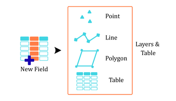

## Goal

Add the same ```Field``` to multiple ```feature classes```.

## Summary

This tool is used to add a new ```attribute field``` with a specific ```field type``` to multiple tables or feature classes in a single operation. 


## Illustration



## Usage Note

* Batch Input Support: Multiple feature classes or tables from different workspaces can be added to the tool.
* Support Field Type: `TEXT`, `SHORT`, `LONG`, `DOUBLE`, `FLOAT`, `DATE`
* Does Not Modify Existing Fields: If a field with the same name already exists in one of the input datasets, the tool will skip that table.

## Parameters

This tool has some importances parameters as show in the table below.

| Parameter | Explanation | Data Type |
|:---------|:------------|:----------|
| Input_Tables | Tables or feature layers to which a new field will be added. Supports one or more inputs.<br> | GPMultiValue |
| Enter_Field_Name | Enter the **new field name**. The field will not be added if a field with the same name already exists in the feature layer or table.<br> | GPString |
| Choose_Field_Type | Choose the field type for the new field. Supported field types include **TEXT, SHORT, LONG, DOUBLE, FLOAT,** and **DATE**.<br> | GPString |

## Tool Demo

Learn how to use the tool

<iframe
  width="100%"
  height="600"
  src="https://www.youtube.com/embed/IgYOWnzz2lA"
  title="Land Parcel Data | Attribute Field Format Checking | KGA TOOLBOX"
  frameborder="0"
  allow="accelerometer; autoplay; clipboard-write; encrypted-media; gyroscope; picture-in-picture; web-share"
  allowfullscreen>
</iframe>

## Purchase Toolbox

See toolbox [license package](pricing.md).

[Contact Sale :fontawesome-solid-paper-plane:](https://t.me/khmergrsacademy){ .md-button target="_blank" rel="noopener"}