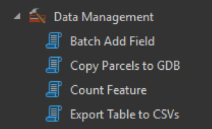

The ```Data Management toolset``` provides a streamlined collection of utilities designed to support efficient handling, organization, and preparation of GIS datasets within ArcGIS workflows. It enables users to batch-add fields across multiple feature classes to ensure schema consistency, copy parcel or spatial datasets into a centralized geodatabase for structured storage, quickly count features for validation and reporting purposes, and export attribute tables into separate CSV files for analysis, sharing, or integration with external systems. 

Together, these tools reduce repetitive manual tasks, improve data standardization, and support reliable data exchange between GIS and non-GIS environments, making the toolset particularly well suited for cadastral management, data cleaning, and routine GIS operations.

__Data Creation Toolset__ consists of 4 tools including:

- [Batch Add Field](batch_add_field.md)
- [Copy Parcels to GDB](parcel_to_GDB.md)
- [Count Feature](count_feature.md)
- [Export Table to CSVs](table_to_csv.md)



__Purchase Toolbox__

See toolbox [license package](../pricing.md).

[Contact Sale :fontawesome-solid-paper-plane:](https://t.me/khmergrsacademy){ .md-button target="_blank" rel="noopener"}