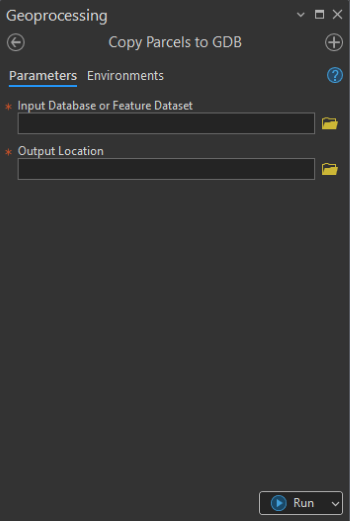
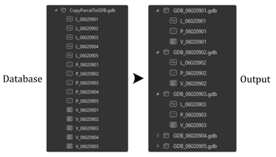

## Goal

Copy `parcel data` that share the same `village code` to `separate file geodatabase`.

## Summary

This tool extracts parcel feature classes from an input database or feature dataset and copies them into a specified geodatabase location. This tool is designed specifically for land parcel data which the copy process can be done by extracting village code information directly from the data in the input database or feature dataset. 

Feature classes with invalid names will not be copied.

## Illustration

## Usage Note

* Input Must Be a `Geodatabase` or `Feature dataset`.
* Automatic Parcel Filtering: Land Parcel in the input will be copied based on __their name__. If those data that valid name, they will be copied into the new file geodatabase with related name.
* Output Location support `Folder` (File System) only.

## Parameters

This tool has some importances parameters as show in the table below.

| Parameter | Explanation | Data Type |
|:---------|:------------|:----------|
| Input_Database | Specifies the source geodatabase or feature dataset from which parcel feature classes will be copied. | GPComposite |
| Output_Location | Specifies the folder or geodatabase where the copied data will be stored. | DEWorkspace |

## Tool Demo

Learn how to use the tool

<iframe
  width="100%"
  height="600"
  src="https://www.youtube.com/embed/IgYOWnzz2lA"
  title="Land Parcel Data | Attribute Field Format Checking | KGA TOOLBOX"
  frameborder="0"
  allow="accelerometer; autoplay; clipboard-write; encrypted-media; gyroscope; picture-in-picture; web-share"
  allowfullscreen>
</iframe>

## Purchase Toolbox

See toolbox [license package](pricing.md).

[Contact Sale :fontawesome-solid-paper-plane:](https://t.me/khmergrsacademy){ .md-button target="_blank" rel="noopener"}