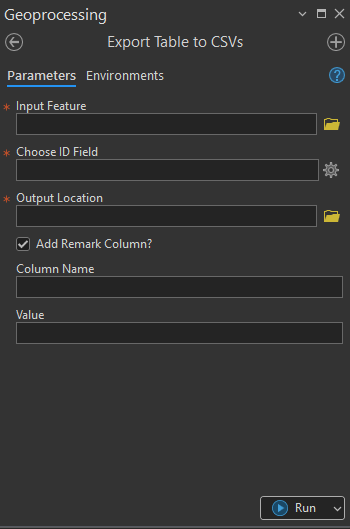
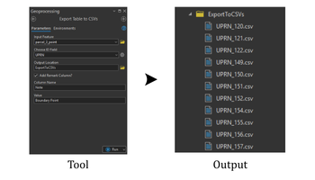

## Goal

Export `table` base on an `ID field` to `separate csv file`.

## Summary

This tool reads the records of an input feature or table and outputs the data into a standard CSV format. It offers an option to include a custom "Remark" column with a specified value for all records.

## Illustration

## Usage Note

* Based on ID Field, the identical rows will be grouped. Each grouped rows will be exported to separate CSV File.
* In case of adding some information, a remark column and information can be added directly from the tool.

## Parameters

This tool has some importances parameters as show in the table below.

| Parameter | Explanation | Data Type |
|:---------|:------------|:----------|
| Input_Feature | The feature class or table whose attribute data will be exported. | GPFeatureLayer |
| Choose_ID_Column | The field containing unique identifiers for the records. This is commonly used to split the output into multiple CSV files based on a grouping value or to ensure record uniqueness. | Field |
| Output_Location | The folder path where the resulting CSV file(s) will be created. | DEFolder |
| Add_Remark_Column? (Optional) | Specifies whether to include an additional, user-defined column in the output CSV files.  • **Check:** Prompts for **Column Name** and **Value**. The column name must not contain spaces. • **Uncheck:** The remark column is not included. | GPBoolean |
| col_name (Optional) | The name of the custom column to be added to the output CSV files. | GPString |
| Remark (Optional) | The uniform value to be populated in the custom remark column for all exported records. | GPString |

## Tool Demo

Learn how to use the tool

<iframe
  width="100%"
  height="600"
  src="https://www.youtube.com/embed/IgYOWnzz2lA"
  title="Land Parcel Data | Attribute Field Format Checking | KGA TOOLBOX"
  frameborder="0"
  allow="accelerometer; autoplay; clipboard-write; encrypted-media; gyroscope; picture-in-picture; web-share"
  allowfullscreen>
</iframe>

## Purchase Toolbox

See toolbox [license package](../pricing.md).

[Contact Sale :fontawesome-solid-paper-plane:](https://t.me/khmergrsacademy){ .md-button target="_blank" rel="noopener"}