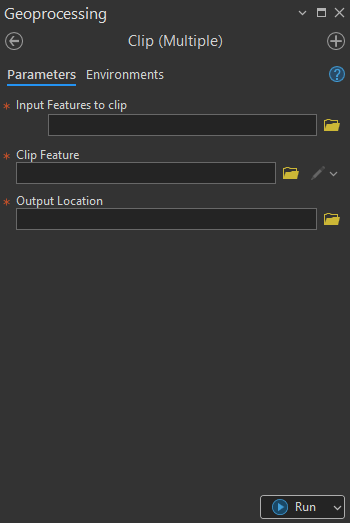

## Goal

Clip `multiple polygons` feature classes by a `clip polygon feature class`.

## Summary

This tool performs a spatial subset of one or more input feature classes or layers. It uses the geometry of the Clip Feature to cut the Input Features. Only the portions of the input features that fall within the boundaries of the clip feature are written in the output feature classes.

## Illustration

## Usage Note

* This tool supports one or multiple Input Feature Classes
* Output workspace supports both file system and database.

## Parameters

This tool has some importances parameters as show in the table below.

| Parameter | Explanation | Data Type |
|:---------|:------------|:----------|
| Input_Feature_to_clip | Feature classes or layers to be spatially subset. | GPMultiValue |
| Clip_Feature | The polygon feature class or layer whose boundaries are used to clip the input features. Only features overlapping this boundary are preserved. | GPFeatureRecordSetLayer |
| Output_Location | The geodatabase or folder where the clipped feature classes will be stored. Output feature classes typically retain the original input names with the `_clip` suffix. | GPComposite |

## Tool Demo

Learn how to use the tool

<iframe
  width="100%"
  height="600"
  src="https://www.youtube.com/embed/IgYOWnzz2lA"
  title="Land Parcel Data | Attribute Field Format Checking | KGA TOOLBOX"
  frameborder="0"
  allow="accelerometer; autoplay; clipboard-write; encrypted-media; gyroscope; picture-in-picture; web-share"
  allowfullscreen>
</iframe>

## Purchase Toolbox

See toolbox [license package](pricing.md).

[Contact Sale :fontawesome-solid-paper-plane:](https://t.me/khmergrsacademy){ .md-button target="_blank" rel="noopener"}