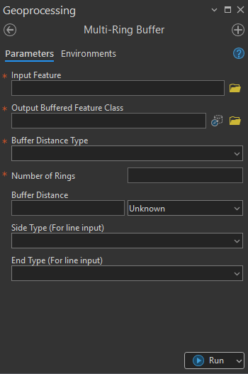

## Goal

## Summary

This tool creates a set of buffer polygons (rings) at specified distances around input features. 

## Illustration

## Usage Note

* The input features can be Point, Line, and Polygon feature class. 
* For point and polygon feature, two options like line-end type and buffer-side type are compulsory are unnecessary and are automatically disabled. 
* This tool accepts two types of buffer distance including Linear Unit and Field. 
* If linear Unit is chosen, linear buffer distance parameter appears which users can input the distance value as well as choose the unit for the process. Otherwise, another option is Field which requires the distance value for each feature to be prepared priorly. The tools process that value of each feature directly from the field.
* This tool is also capable of producing multiple rings simultaneously based on Number of Rings acquired by the user-input. If Number of Rings are more than one, another flexible option appears which let users able to input variate distance between each ring or choosing the equal distance.

## Parameters

This tool has some importances parameters as show in the table below.

| Parameter | Explanation | Data Type |
|:---------|:------------|:----------|
| Input_Feature | Input feature layer to be buffered. | GPFeatureLayer |
| Output_Buffered_Feature_Class | Specifies the location and name of the buffered feature class. | DEFeatureClass |
| Buffer_Distance_Type | Defines how buffer distance is provided.  • **Linear Unit:** Fixed buffer distance with a specified unit. • **Field:** Uses a numeric attribute field representing buffer distance. | GPString |
| Number_of_Rings | Specifies the number of buffer rings. If more than one ring is used, the ring interval can be set as equal or variable. | GPLong |
| Equal_rings_interval (Optional) | Option to buffer using equal or variable ring distances.  • **Check:** Fixed (equal) buffer distance. • **Uncheck:** Variable buffer distance. | GPBoolean |
| Specify_Ring_Interval (Optional) | Used when the number of rings is greater than one and equal ring interval is not selected. Enter variable distances separated by commas (e.g., `10,20` for two rings). | GPString |
| Buffer_Distance (Optional) | Enter a numeric buffer distance value and select a unit. | GPLinearUnit |
| Choose_Field (Optional) | Choose the field containing buffer distance values. | Field |
| Side_Type_For_line_input (Optional) | Specifies the buffer side when the input geometry is a line. | GPString |
| End_Type_For_line_input (Optional) | Specifies the line-end type when the input geometry is a line. | GPString |

## Tool Demo

Learn how to use the tool

<iframe
  width="100%"
  height="600"
  src="https://www.youtube.com/embed/IgYOWnzz2lA"
  title="Land Parcel Data | Attribute Field Format Checking | KGA TOOLBOX"
  frameborder="0"
  allow="accelerometer; autoplay; clipboard-write; encrypted-media; gyroscope; picture-in-picture; web-share"
  allowfullscreen>
</iframe>

## Purchase Toolbox

See toolbox [license package](pricing.md).

[Contact Sale :fontawesome-solid-paper-plane:](https://t.me/khmergrsacademy){ .md-button target="_blank" rel="noopener"}