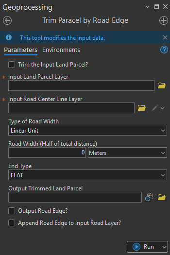

## Goal

Modify `land parcel boundaries` by removing areas intersecting the `road edge`.

## Summary

This tool is designed for cadastral and land-parcel management workflows where parcel boundaries must be trimmed to align with road edges. It generates a road buffer using either a fixed linear distance or an attribute field from the road centerline layer. 

The buffer is used to erase the overlapped area from the input land parcels. Optional outputs include generating the actual road-edge buffer polyline and appending it back into the road layer for further use.

## Illustration

## Usage Note

* Input Road Centerlines Layer must be polyline feature class.
* Input Land Parcel features must be polygon feature class.
* There are two process modes in this tool – user will have an option to trim the input land parcel or create a new trimmed land parcel without messing with the input. This can be done by checking the first parameter Trim the input land parcel.
* If “Linear Unit” is selected, `Road Width` parameter accepts Numeric values (greater than 0)
* If “Field” is selected, choose a numeric field representing the road width (full width not half), the tool will calculate the half width automatically.
* Buffered Road End Type supports FLAT and ROUND only.
* If Trim the input land parcel parameter isn’t checked, output trimmed parcels path is required for the tool to run.
* Optionally, road edge polyline can be exported and placed on the same path as the road centerline. Additionally, users can also append the generated road edge to the input road centerline directly, if necessary.

## Parameters

This tool has some importances parameters as show in the table below.

| Parameter | Explanation | Data Type |
|:---------|:------------|:----------|
| Trim_input_parcel? (Optional) | Determines whether the input parcel layer is modified directly or a new trimmed output is created.  • **Check:** The input parcel layer is trimmed directly. • **Uncheck:** A new trimmed parcel output is created. | GPBoolean |
| Input_Parcel | Input land parcel layer to be trimmed. | GPFeatureLayer |
| Input_Road_Center_Line | Input road centerline layer. | GPFeatureRecordSetLayer |
| Road_Width_type | Specifies how road width is defined.  • **Linear Unit:** Enter a numeric value and unit. • **Field:** Use a numeric field from the road layer containing width values. | GPString |
| Road_Width_(Value) (Optional) | Enter the road width value (half of total width) and choose a unit. The default unit is meters. | GPLinearUnit |
| Road_Width_(Field) (Optional) | Select a numeric field from the road layer containing full-width values. | Field |
| Road_End_Type | Specifies the end type of the buffered road. The default is **FLAT**.  • **ROUND:** Rounded end type. • **FLAT:** Flat end type. | GPString |
| Output_Trimmed_Parcel (Optional) | Specifies the location and name of the output trimmed parcel feature class. | DEFeatureClass |
| Output_Road_Polygon? (Optional) | Option to export the buffered road-edge feature. The output road edge is created at the same location as the input road centerline layer.  • **Check:** Output road-edge polyline is created. • **Uncheck:** No output is generated. | GPBoolean |
| Append_Road_Edge_to_Input_Road_Layer? (Optional) | Option to append the generated road-edge polyline into the input road centerline layer.  • **Check:** Road-edge polyline is appended to the input road centerline. • **Uncheck:** Road-edge polyline is not appended. | GPBoolean |

## Tool Demo

Learn how to use the tool

<iframe
  width="100%"
  height="600"
  src="https://www.youtube.com/embed/IgYOWnzz2lA"
  title="Land Parcel Data | Attribute Field Format Checking | KGA TOOLBOX"
  frameborder="0"
  allow="accelerometer; autoplay; clipboard-write; encrypted-media; gyroscope; picture-in-picture; web-share"
  allowfullscreen>
</iframe>

## Purchase Toolbox

See toolbox [license package](../pricing.md).

[Contact Sale :fontawesome-solid-paper-plane:](https://t.me/khmergrsacademy){ .md-button target="_blank" rel="noopener"}