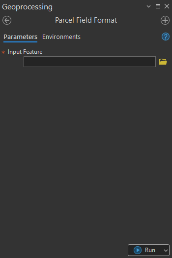

## Summary
This tool checks and standardizes the attribute field format of Land Parcel Polygon which is required by MLMUPC. If any field of the standard attribute field is missing from the input parcel layer. The tool creates the field for it. It also checks the field properties as well.

## Usage Note

* This temporarily supports only Feature Layer (Feature class that has been added to the map). Will support both check (feature layer and feature class) in the future.
* May miss check if the input is not actually the land parcel data. However, tool will warn user to check with a warning message suggesting user to check the data before running the tool.

## Parameters

This tool has some importances parameters as show in the table below.

| Parameter | Explanation | Data Type |
|:---------|:------------|:----------|
| Input_Feature | Input land parcel layer to be checked. | GPMultiValue |
| Output_update_feature_class_to_difference_workspace? (Optional) | Appears when a field whose properties do not match the standard is detected.  • **Check:** Outputs the updated data to a different location. • **Uncheck:** The updated data is stored at the same path as the input layer. | GPBoolean |
| Specify_output_workspace (Optional) | Specifies the workspace where the updated data will be stored. Works with **File Geodatabase only**. | GPComposite |

## Tool Demo

Learn how to use the tool

<iframe
  width="100%"
  height="600"
  src="https://www.youtube.com/embed/IgYOWnzz2lA"
  title="Land Parcel Data | Attribute Field Format Checking | KGA TOOLBOX"
  frameborder="0"
  allow="accelerometer; autoplay; clipboard-write; encrypted-media; gyroscope; picture-in-picture; web-share"
  allowfullscreen>
</iframe>

## Purchase Toolbox

See toolbox [license package](../pricing.md).

[Contact Sale :fontawesome-solid-paper-plane:](https://t.me/khmergrsacademy){ .md-button target="_blank" rel="noopener"}