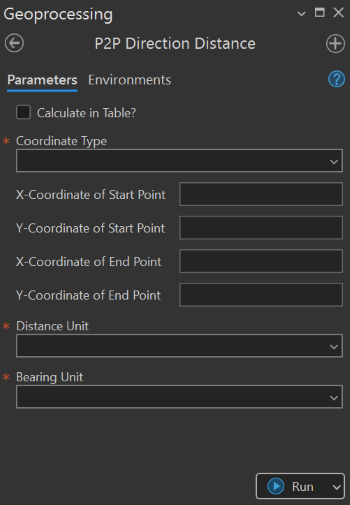

## Summary
This tool is used to calculate the direction (Naz or QB) and distance between two points based on the input coordinate (projected coordinate or geographic coordinate). This tool has two process modes: calculating based on user input and using coordinate table.

## Usage Note

* In calculating based on user input case, tool requires the input of coordinate value of both start and end point. The coordinate value can be either XY or LatLon.
* The result can be seen in tool `message window`.
* In case of calculating in table, on the other hand, the tool requires the coordinate table to be prepared priorly. The table should contain `X-coordinate`, `Y-coordinate` of `starting point` and `X-coordinate`, `Y-coordinate` of `ending point`, respectively. The result will be output to a new table and stored at a destinated location.

## Parameters

This tool has some importances parameters as show in the table below.

| Parameter | Explanation | Data Type |
|:---------|:------------|:----------|
| Calculate_in_Table? (Optional) | Option to choose the calculation mode.  • **Check:** Calculates distance and bearing using a coordinate table. • **Uncheck:** Calculates distance and bearing based on user input coordinates. | GPBoolean |
| Coordinate_Type | Specifies the coordinate type to be used.  • Geographic coordinate • Projected coordinate | GPString |
| Input_X1 (Optional) | X-coordinate of the starting point. | GPDouble |
| Input_Y1 (Optional) | Y-coordinate of the starting point. | GPDouble |
| Input_X2 (Optional) | X-coordinate of the ending point. | GPDouble |
| Input_Y2 (Optional) | Y-coordinate of the ending point. | GPDouble |
| Input_Table_(CSV) (Optional) | Input coordinate table in CSV (comma-delimited) format. The table must contain coordinate pairs for both starting and ending points, using one of the following column naming conventions:  • **X1, Y1, X2, Y2** • **E1, N1, E2, N2** • **Easting1, Northing1, Easting2, Northing2** • **Lon1, Lat1, Lon2, Lat2** • **Longitude1, Latitude1, Longitude2, Latitude2** | DETable |
| Output_Table_(CSV) (Optional) | Specifies the output table location and name. | DETable |
| Distance_Unit | Specifies the distance unit to be used. | GPString |
| Bearing_Format | Specifies the bearing format. | GPString |

## Tool Demo

Learn how to use the tool

<iframe 
    width="1218" 
    height="685" 
    src="https://www.youtube.com/embed/IieZnis4lOM" 
    title="[KGA TOOLBOX] - Calculate Direction Distance | LATEST Update" 
    frameborder="0" 
    allow="accelerometer; autoplay; clipboard-write; encrypted-media; gyroscope; picture-in-picture; web-share" 
    referrerpolicy="strict-origin-when-cross-origin" 
    allowfullscreen>
</iframe>

## Purchase Toolbox

See toolbox [license package](../pricing.md).

[Contact Sale :fontawesome-solid-paper-plane:](https://t.me/khmergrsacademy){ .md-button target="_blank" rel="noopener"}