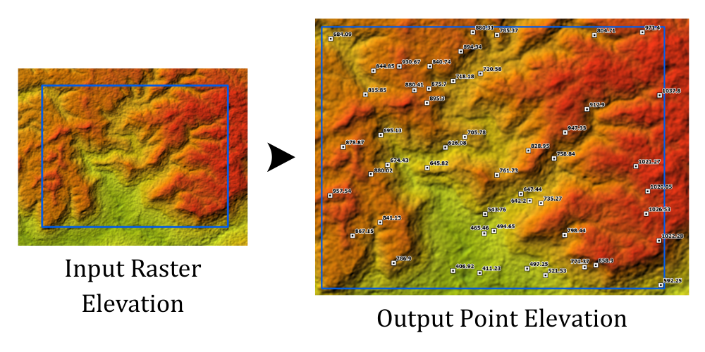

## Summary
This tool is used to generate spot height data by extracting elevation value from DEM data. This tool can create spot height data for any region of interest or using existing point. It finally outputs the point data which the attributes contain elevation value and coordinate field.

## Illustration

## Usage Note

* This tool can either accept a boundary input to create spot elevation point or exist point.
* If using boundary, number of points need to be specified which allow to generate the spot point randomly within the region of interest.

## Parameters

This tool has some importances parameters as show in the table below.

| Parameter | Explanation | Data Type |
|:---------|:------------|:----------|
| Use_Existing_Point? (Optional) | Option to generate spot height data.  • **Check:** Extracts elevation values and calculates coordinates for existing point data. • **Uncheck:** Randomly generates spot elevation points within the study boundary based on the specified number of points. | GPBoolean |
| Input_Study_Area (Optional) | Input region of interest (boundary). | GPFeatureRecordSetLayer |
| Input_Point_Feature (Optional) | Existing point data used to extract elevation values and calculate coordinates. | GPFeatureRecordSetLayer |
| Input_Elevation_Raster (Optional) | Input elevation raster data (DEM). | GPRasterLayer |
| Number_of_Samples (Optional) | Number of spot elevation points to generate. | GPLong |
| Output_Spot_Elevation (Optional) | Specifies the location and name of the output spot height feature class. | DEFeatureClass |

## Tool Demo

Learn how to use the tool

<iframe 
    width="1218" 
    height="685" 
    src="https://www.youtube.com/embed/du7U7ySyOzo" 
    title="Generate Spot Height for Topographic Map | KGA TOOLBOX" 
    frameborder="0" 
    allow="accelerometer; autoplay; clipboard-write; encrypted-media; gyroscope; picture-in-picture; web-share" 
    referrerpolicy="strict-origin-when-cross-origin" 
    allowfullscreen>
</iframe>

## Purchase Toolbox

See toolbox [license package](../pricing.md).

[Contact Sale :fontawesome-solid-paper-plane:](https://t.me/khmergrsacademy){ .md-button target="_blank" rel="noopener"}