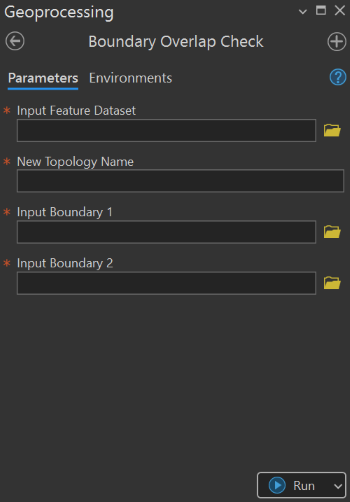

## Goal

Check the `overlap boundary` of two input polygons.

## Summary

This tool checks the overlap between two polygon features. It used topology and a rule specified in that topology to check the existence of overlaps within the two boundaries. 

## Illustration

## Usage Note

* This tool has two process modes; use existing topology by adding the two boundaries to it and applying the rule, create a new topology.
* A rule used by this tool is called Must Not Overlap With (Area-Area).
* After creating topology or adding boundaries to the existing topology, rule applied to them, then topology is automatically validated by the tool.
* The boundaries and the topology must be stored at the same feature dataset, otherwise, the tool won’t work.

## Parameters

This tool has some importances parameters as show in the table below.

| Parameter | Explanation | Data Type |
|:---------|:------------|:----------|
| Input_Feature_Dataset | Input feature dataset where the topology will be created. | DEFeatureDataset |
| Output_Topology_Name | Name of the new topology to be created. | GPString |
| Input_Boundary_1 | First feature class whose boundary will be checked. | GPFeatureLayer |
| Input_Boundary_2 | Second feature class whose boundary will be checked. | GPFeatureLayer |

## Tool Demo

Learn how to use the tool

<iframe
  width="100%"
  height="600"
  src="https://www.youtube.com/embed/IgYOWnzz2lA"
  title="Land Parcel Data | Attribute Field Format Checking | KGA TOOLBOX"
  frameborder="0"
  allow="accelerometer; autoplay; clipboard-write; encrypted-media; gyroscope; picture-in-picture; web-share"
  allowfullscreen>
</iframe>

## Purchase Toolbox

See toolbox [license package](../pricing.md).

[Contact Sale :fontawesome-solid-paper-plane:](https://t.me/khmergrsacademy){ .md-button target="_blank" rel="noopener"}