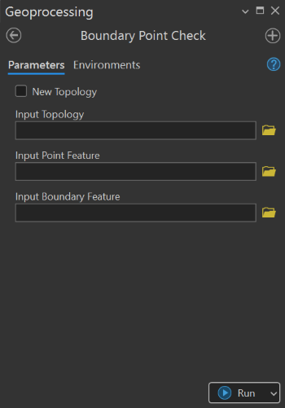

## Goal

Check the `consistency of point` along the `boundaries` of polygon feature class.

## Summary

This tool checks the spatial relationship between point features and a defined boundary feature. It identifies points that fall inside, outside, or directly on the boundary and reports all points that violate the intended positional constraints. 

This tool uses a topology rule to ensure consistent and repeatable spatial validation.

## Illustration

## Usage Note

* This tool has two process modes: using an existing topology and creating a new topology.
* When New Topology is enabled, the tool creates a new topology and adds the rules for boundary conformity checks.
* The rule: Must Be Covered By Boundary Of (Point-Area)
* When using an existing topology, the tool requires that the topology already resides in the same feature dataset as the input features.
* The boundary feature support only polygon geometry.

## Parameters

This tool has some importances parameters as show in the table below.

| Parameter | Explanation | Data Type |
|:---------|:------------|:----------|
| New_Topology? (Optional) | Indicates whether a new topology should be created for the validation process.  • **Check:** A new topology is created in the workspace of the input features. • **Uncheck:** An existing topology is used. | GPBoolean |
| Input_Topology (Optional) | Specifies an existing topology. The topology must reside in the same feature dataset as the input feature classes. | DETopology |
| Input_Point_Feature (Optional) | Point feature class whose spatial conformity to the boundary will be evaluated. | GPFeatureLayer |
| Input_Boundary_Feature (Optional) | Boundary feature class defining the allowable spatial extent for the input points. | GPFeatureLayer |

## Tool Demo

Learn how to use the tool

<iframe
  width="100%"
  height="600"
  src="https://www.youtube.com/embed/IgYOWnzz2lA"
  title="Land Parcel Data | Attribute Field Format Checking | KGA TOOLBOX"
  frameborder="0"
  allow="accelerometer; autoplay; clipboard-write; encrypted-media; gyroscope; picture-in-picture; web-share"
  allowfullscreen>
</iframe>

## Purchase Toolbox

See toolbox [license package](../pricing.md).

[Contact Sale :fontawesome-solid-paper-plane:](https://t.me/khmergrsacademy){ .md-button target="_blank" rel="noopener"}