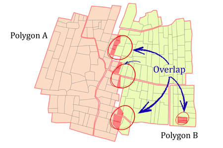

## Summary
The Topology Check tool evaluates the spatial integrity of one or more feature classes by applying topology rules within a feature dataset. It automatically generates a topology, applies rules, and validates the input features. This tool has ability to check the gap and overlap between features themselves and the overlap between input polygons.

## Illustration

## Usage Note

* The Output Topology must be created inside a Feature Dataset
* All Input Features must reside within the same feature dataset where the topology will be created.
* The tool automatically adds feature classes to the topology, adds rules, and validates that topology.
* Rules used Must Not Have Gaps (Area), Must Not Overlap (Area), Must Not Overlap With (Area-Area)
* The tool may take longer processing time in checking overlap between input polygons if those polygons have more features in them.

## Parameters

This tool has some importances parameters as show in the table below.

| Parameter | Explanation | Data Type |
|:---------|:------------|:----------|
| Output_Topology | Specifies the location and name of the new topology. | DETopology |
| Input_Features | Input feature classes to be checked. | GPMultiValue |

## Tool Demo

Learn how to use the tool

<iframe
  width="100%"
  height="600"
  src="https://www.youtube.com/embed/IgYOWnzz2lA"
  title="Land Parcel Data | Attribute Field Format Checking | KGA TOOLBOX"
  frameborder="0"
  allow="accelerometer; autoplay; clipboard-write; encrypted-media; gyroscope; picture-in-picture; web-share"
  allowfullscreen>
</iframe>

## Purchase Toolbox

See toolbox [license package](../pricing.md).

[Contact Sale :fontawesome-solid-paper-plane:](https://t.me/khmergrsacademy){ .md-button target="_blank" rel="noopener"}